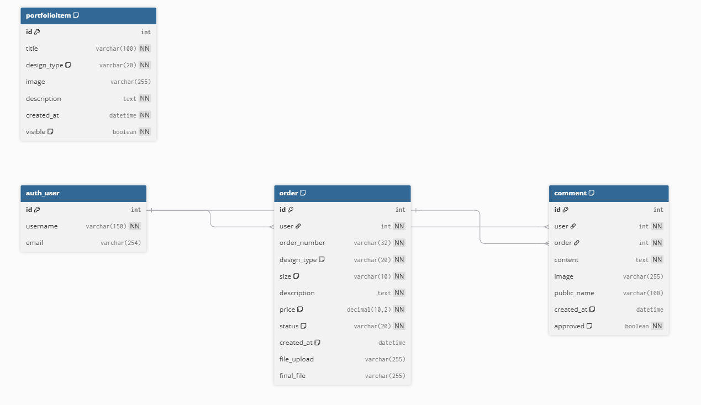
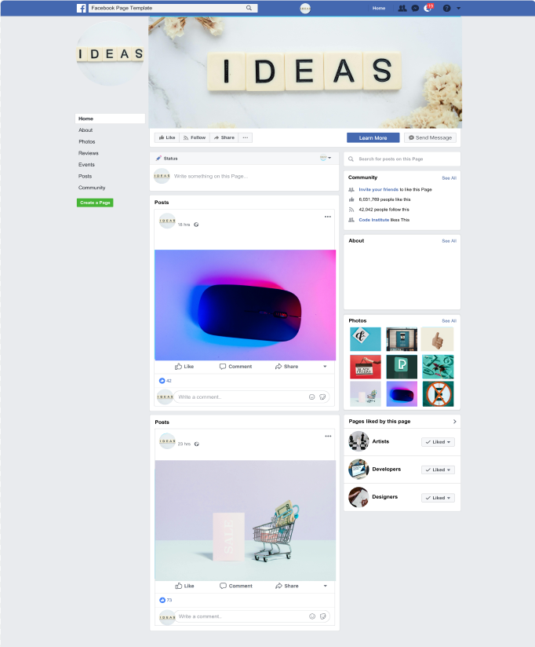

# GetMyDesign

GetMyDesign is a complete website where users can bring their imaginative ideas for custom logos, icons, and posters to life. The platform aims to provide high-quality, personalized graphic design services to clients worldwide. Its target audience includes individuals and businesses seeking unique, tailor-made visual designs. The business model is based on one-time payments processed securely via Stripe.

## User Stories & Planning

This project was planned using the principles of Agile. A public GitHub board was created with different iterations to help organize and focus on each one during specific time periods. Each user story was organized into different epics and prioritized using the MoSCoW method.
[Original Project on GitHub](https://github.com/Katia-D15/getmydesign-stories.git)

## Data Model 

### Models

### Diagrams

## UX Design

### Colors

### Mockups

## Features

### Existing Features

**_Navigation Bar_**

Navigation bar (logged out):
- Home
- Previous Work
- Portfolio Items
- Make a Request
- Register
- Login

Navigation bar (logged in):
- Home
- Previous Work
- Portfolio Items
- My Orders
- Request your Design
- Logout

**_Home page_**

On the Home page, there are four sections: a hero section featuring an illustrative image (currently from our Facebook profile) and a slogan, with a button linking to the Portfolio Items page; one section showing three sample images of different design types; and two sections linking to pages for previous work and for requesting a design. In Request a Design, logged-in users go straight to the request form, while others are redirected to the login page (with an option to register).

**_Register_**

The Register page allows new users to create an account by filling out a form. To register, users must provide a valid email address, a username and a valid password.

**_Login_**

The Login page lets registered users sign in using their email address and password.

**_Logout_**

Allows users to confirm and complete the log-out process with a single click.

**_Previous Work_**

This page displays different content depending on the user's login status. For anonymous users, it shows all approved comments with _Completed_ status, reviewed by the admin. For logged-in customers, it shows a comment form for each order with a _Completed_ status, where they can share their opinion about the final design.

**_Request your Design_**

A page where users can submit a request and view its price.
The form includes two fields: one for selecting the design type from a dropdown, and another for describing the desired custom design. Finally, users can optionally upload an image to give a better idea of what they want.

**_My Orders_**

On the My Orders page, the user will either see the message "You don't have any orders yet", or view a list of all orders with their respective order numbers and statuses. The status can be _Pending_, _Confirmed_, _Cancelled_, or _Completed_.

**_Order Review_**

On the Order Review page, the user can verify all details and review the price before proceeding to payment. If necessary, they may return to edit the order, cancel it if no longer interested, or confirm and proceed with payment if everything is correct.

**_Checkout_**

On the Checkout page, users review their order and enter their card details to complete the purchase.
Secure card payments via Stripe (Payment Intents).

**_Portfolio items_**

On the Portfolio Items page, users can browse and filter our work by design type.

**_Footer_**

The footer includes a phone number and links to various social media platforms.

### Features Left to Implement
- Add a front-end page for admins to approve or reject comments (instead of using the Django admin dashboard).
- Enforce a maximum number of requests with a "pending" status.
- Improve the email body sent after a successful payment.

## UX Design

### (ERD) Entity-Relationship Diagram (DBML - Database Markup Language)

## Web Marketing

### Facebook page

## Payments
GetMyDesign uses Stripe for card payments.

Test cards

Use Stripe's test cards

Environment variables
- STRIPE_PUBLIC_KEY
- STRIPE_SECRET_KEY
- STRIPE_WH_SECRET

## Technologies

### Technologies Used
- **Languages:** Python, JavaScript, HTML, CSS
- **Frameworks & Libraries:** Django, Bootstrap, Font Awesome, Django Allauth, Crispy Forms, Google fonts
- **Database:** PostgreSQL from Code Institute
- **Payment Processing:** Stripe

## Testing

### Validator Testing

-HTML
-  [W3C HTML Validator](https://validator.w3.org/)

-CSS
-  [W3C CSS Validator](https://jigsaw.w3.org/css-validator/)
        
-Python
-  [Code institute CI Python Linter](https://pep8ci.herokuapp.com/#)

-JavaScript
- [JSHint](https://jshint.com/)

-Tools used:

**Lighthouse**

**Manual Tests**
- A success message is displayed after login.
- A success message is displayed after logout.
- A success message is displayed after confirming the email address.
- A success message is displayed after creating an order.
- A success message is displayed after editing an order.
- The **Cancel** button shows a confirmation alert before cancelling an order.
- A success message is displayed after confirming the cancellation.
- A success message is displayed after a successful payment.
- The `checkout_success` template is displayed after a successful payment.
- An error message appears below the card input if something is wrong.
- The **Make a Request** link opens the login page if the user is not logged in.
- The **Request your Design** button redirects the user to the login page if the user is not logged in.
- The **Request your Design** button redirects the user to the **Request your Design** page if the user is logged in.
- Social media icons for Twitter, Instagram, and YouTube open the corresponding social pages.
- The **Previous Work** link displays all comments approved by the site owner if the user is logged out.
- The **Previous Work** link displays the comment form for each order marked "completed" when the user is logged in and has at least one completed order.
- The **My Orders** page displays all orders made by the customer if any exist; otherwise, it displays a message "You don't have any orders yet".
- The **My Orders** page displays all orders with their current status.
- When a user submits an order, it is saved with a "pending" status.
- The "Resume request" button only appears for orders with a "pending" status.
- If the user cancels a submitted order, it is saved with a "cancelled" status.
- Users can edit an order only while it is in the "pending" status.
- The order status changes to "confirmed" after a successful payment.
- When the site owner uploads the final file, the status changes to "completed" and a Download button appears.
- The **Request your Design** page displays an order form.
- On the **Request your Design** page, the price updates automatically based on the selected design type and size.
- On the **Request your Design** page, the "Choose File" button lets users upload a file.
- After a request is submitted successfully, the user is redirected to the **Order Review** page.
- The **Order Review** page displays all details of the submitted request and includes buttons for Edit, Cancel, and Proceed to Payment.
- The **Portfolio Items** page displays the message "No items available" when there are no items.
- The **Portfolio Items** page displays all items uploaded by the site owner with `visible=True`.
- The design-type filter on **Portfolio Items** shows items that match the selected type.
- The Clear button on the **Portfolio Items** page resets the filter and shows all items again.
- If the user tries to access a page that does not exist, the site displays a 404 error page.
- If the site owner tries to save an order with a "completed" status without a final file, a message is displayed on the dashboard.
- The site owner can save orders with the "completed" status in the dashboard only if they are already "confirmed" and the final file has been uploaded.
- After a successful payment, the authenticated user receives a confirmation email.

### Unfixed Bugs

## Local Development Setup

### Prerequisites
- Python 3.12
- Git

**Clone the repository** 
Terminal:

git clone https://github.com/Katia-D15/get_my_design.git  
cd get_my_design

**Create and activate a virtual environment** 
`python -m venv .venv`

Activate:
- Windows (PowerShell)
`.\.venv\Scripts\Activate`

- macOS/Linux
`source .venv/bin/activate`

**Install dependencies** 
`pip install -r requirements.txt `

**Environment variables**  
Create an env.py file in the project root

**Database setup** 
`python manage.py migrate`

**Run the development server** 
`python manage.py runserver`

## Deployment

This project is deployed on **Heroku**

### Project requirements (before deploying)
**Make sure these packages are in `requirements.txt`**
- gunicorn 
   - `pip install gunicorn ~= 20.1`
- whitenoise
   - `pip install whitenoise ~=6.5.0`

- Create the Procfile file  
   - Inside the Procfile insert:  `web: gunicorn get_my_design.wsgi`
- Create the .python-version file  
    - Inside inser the respective version

**Create the Heroku app**

(New-Create new app)

**Prepare the code for deployment**

_Settings_
DEBUG = False
ALLOWED_HOSTS = ["<your-app>.herokuapp.com", '127.0.0.1']

**Set Config Vars**

(Heroku-Settings- Reveal Config Vars)
- `DATABASE_URL`
- `SECRET_KEY`
- `STRIPE_PUBLIC_KEY`
- `STRIPE_SECRET_KEY`
- `STRIPE_WH_SECRET`

**Build & Deploy**

Heroku-Deploy-"Connect to GitHub"-select the repository-Deploy
- Deploy Branch
- Open app

## SEO (Search Engine Optimization)

**Keywords**

- request a custom graphic design
- logo design
- icon design
- poster design
- graphic design services
- custom graphic design
- online graphic design services
- custom logo design
- custom icon design
- custom poster design
- request your design

**User needs**

- Visitors: understand services; see examples by design type
- Customers: request a design, review and comment

**Information & resources provided**

- Portfolio Items
- Previous Work
- Request your Design
- My Orders/ Order Review

**Clarity & readability**

- Consistent naming (Home, Portfolio Items, Previous work,Request your Design)
- Hero with slogan

**Trust**

- Comments in Previous work page
- Completed work on Portfolio Items
- Social links in the footer

**Internal linking**

- Home -> Portfolio Items
- Home -> Previous work page

**External linking**

- Social profiles (Facebook)

**Discovery**

- navbar
- buttons

## Credits

### Content
- The base template (`base.html`) and  code to build checkout app were taken from the Code Institute's Boutique_Ado_v1 Project.
-

### Media
- The images used on the website were taken from: [Pexels](https://www.pexels.com/)
